# Parallax2D FAQs

## Why do my infinite repeat textures get cut off at random times?

This can have a lot of different answers and approaches based on what kind of game you're making and what style you're going for. We'll go over the how and why of each problem you may encounter.

### **Bad positioning:**

As a quick rundown, when you set `Parallax2D`'s `repeat_size` you're telling the node that it should snap the child node's position back every time the camera scrolls by the set amount. The infinite repeat effect is achieved by adding a single repeat of all the child textures. While the camera scrolls between the image and its repeat, it invisibly snaps back giving the illusion of a looping image. Let's show this in practice.

Oftentimes, users will set all of their textures to be centered at `(0,0)`:

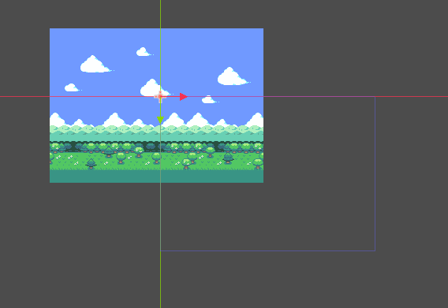

This will create problems with the infinite repeat effect and should be avoided. The "infinite repeat canvas" starts at `(0,0)` and expands down and to the right to the size of your `repeat_size` value. 

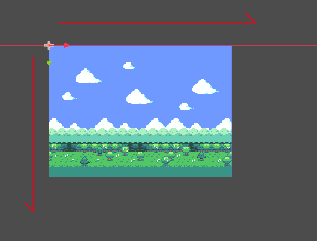

If you have your image centered on the `(0,0)` crossing, your infinite repeat canvas is only partly covered, so it will only partly repeat.

#### **Couldn't I just increase the `repeat_times`?**

That technically *would* work in some scenarios, but is a brute force solution and not the problem `repeat_times` is designed to solve (we'll go over this in a bit). The better fix is to understand how the repeat effect works and set up the parallax textures appropriately to begin with.

First, check to see if your image is spilling over onto the negative parts of the canvas. Make sure the textures used in your parallax nodes fit inside your "infinite repeat canvas" starting at `(0,0)`. That way, when the `repeat_size` is set for the `Parallax2D`, it should look something like this, with one single loop of the image the same size or larger than the viewport:

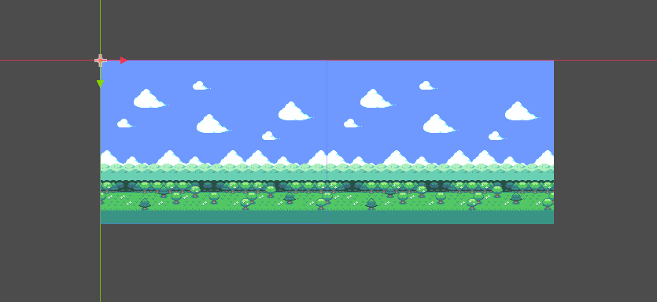

If you think of how the image scrolls across the screen, it starts by displaying what's inside the red rectangle (determined by `repeat_size`), and when it reaches what's inside the yellow rectangle it'll zip the image forward to give the illusion of scrolling infinitely. It also does the same in reverse.

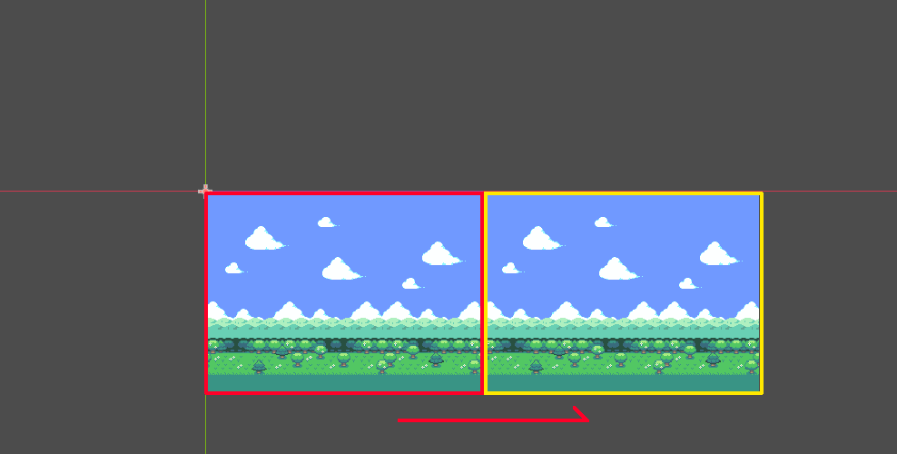

If you have the image positioned away from the "infinite repeat canvas", when the camera reaches the yellow rectangle, half of the image is cut off before it zips forward, like in the image below.

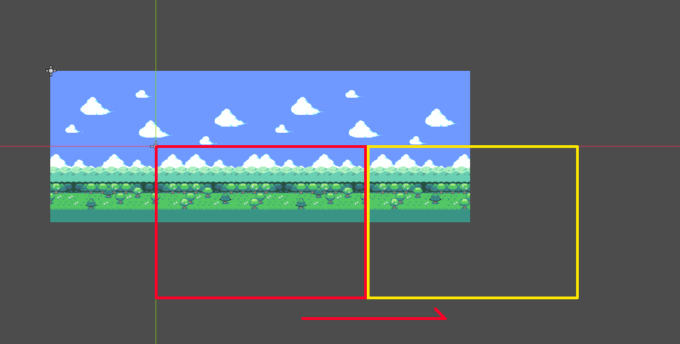

#### **What if I prefer it centered?**

If you prefer the image to start at a different point, `Parallax2D` comes with a `scroll_offset` property you can use to offset where the infinite repeat canvas starts. For example, if your image is `288 x 208`, set the `scroll_offset` to `(-144,0)` or `(144,0)` and it'll begin halfway across the image.

### **Bad sizing:**

The infinite repeat effect is easiest to work with when you have an image that's designed for the size of your screen and designed to repeat seemlessly. If you aren't able to obtain assets that are designed to repeat, there are some other things you can do to better prepare your image in regards to size.

Here is an example of a texture with poor sizing compared to its viewport:

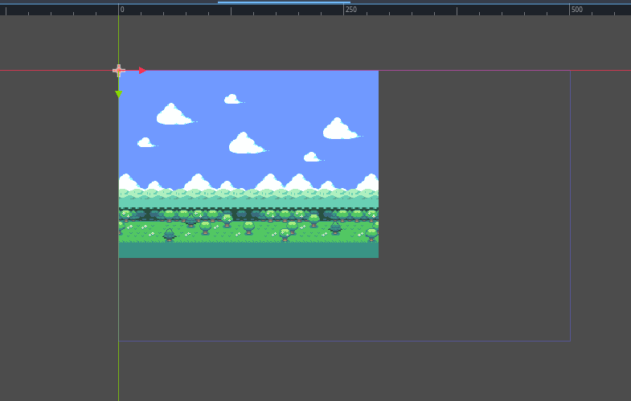

We can see that the viewport size is `500 x 300` but the image is `288 x 208`. If we made the `repeat_size` the size of our image, it wouldn't be large enough since it doesn't cover the viewport. If we made the `repeat_size` the size of the viewport we'd have a large gap. What can we do?

#### **Make the viewport smaller:**

The simplest answer is to make the viewport the same size or smaller than your textures. You can click on `Project -> Project Settings -> Window` and change the viewport height and width to match your background.

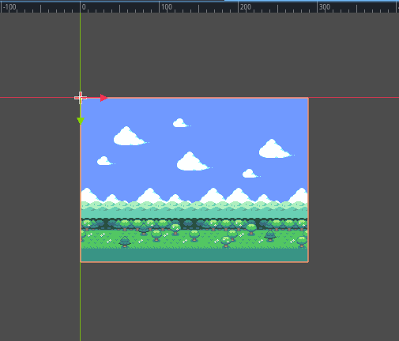

#### **Scale the `Parallax2D`:**

If you're not aiming for a pixel-perfect style, or don't mind a little blurriness, you may just opt to make the textures larger to fit your screen. Set the scale of the `Parallax2D` itself, and all child textures will be scaled as well.

#### **Scale the `Sprite2D`(s):**

Similar to scaling the `Parallax2D`, you can scale your `Sprite2D` nodes to be the large enough to cover the screen. However, keep in mind that some settings like `Parallax2D`'s `repeat_size` and `Sprite2D`'s `region_rect` do not take scaling into account, so you'll need to adjust these values based on the scale.

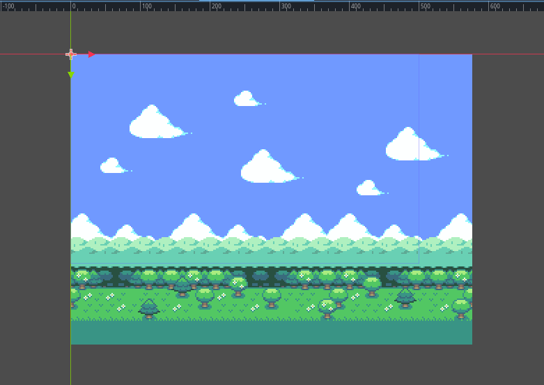

#### **Repeat the textures:**

In `Sprite2D` nodes, you can set the `texture_repeat` to `enabled`, enable `region_enabled`, and then set the `region_rect` to a big enough multiple of the size of your texture to cover the viewport. You can then use the `Sprite2D` as if the original texture was the correct size all along!

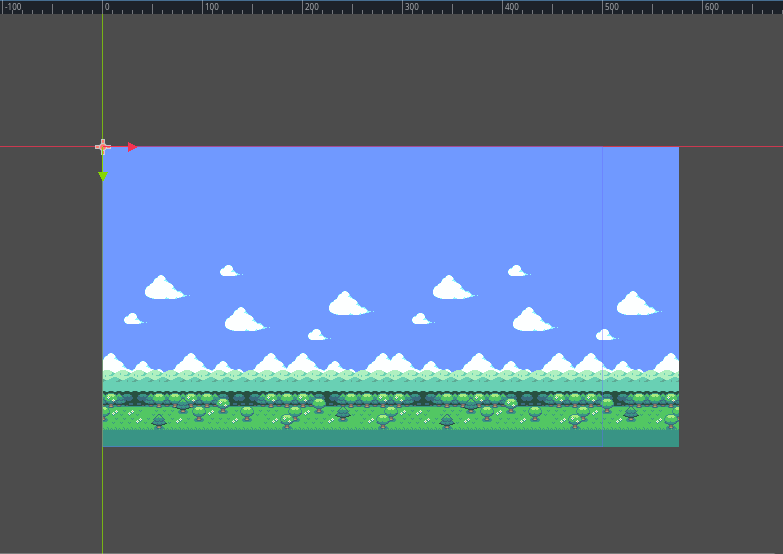

## Zoom sizing

Ideally, using the previous solutions, your parallax textures will be large enough to cover the screen even when zoomed out. We have a perfect fit of a `288 x 208` texture inside a `288 x 208` viewport. However, here's what happens when we zoom out by setting the `Camera2D`'s `zoom` to `0.5`:

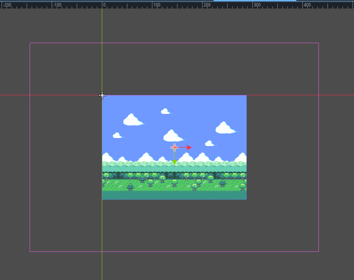

Even though everything was perfectly set for viewport at our normal zoom level it's now smaller than the viewport, breaking the infinite repeat effect. This is where `repeat_times` can help us out. If we set its value to `3` (one extra repeat behind and in front) it is now large enough to accomodate the infinite repeat effect.

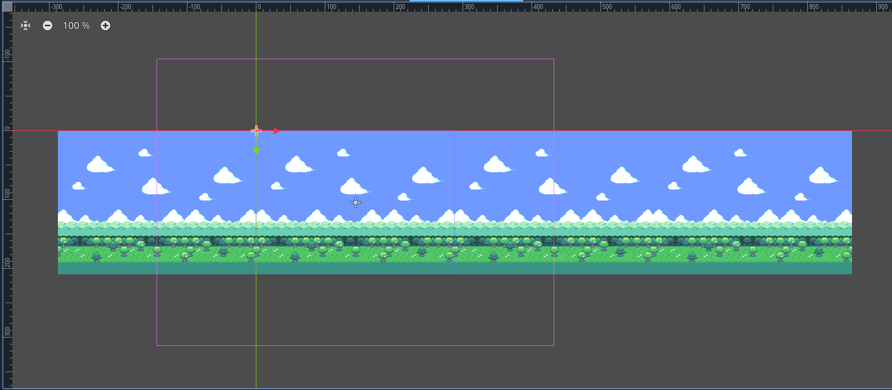

If this image were meant to be repeated vertically, the `repeat_times` would also add a repeat above and below as well, but because it isn't, it leaves an empty block above and below the image. How do we solve this? We need to get creative! In this example, we stretch the sky higher, and grass sprite lower.

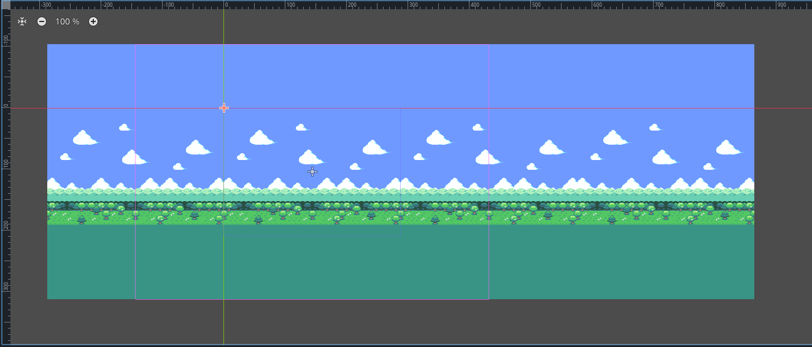

## How do I use `Parallax2D` with split screen?

There are many tutorials out there for making a split screen game. Most will begin by writing a small script to assign the first `SubViewport`'s `World2D` to the second, so they have a shared display. Questions often pop up about how to share a parallax effect between both screens as well.

The parallax effect is based on faking a perspective by moving the positions of different textures in relation to the camera. This is understandably problematic if you have multiple cameras, since your textures can't be in two places at once! 

This can still be achieved by cloning your background into the second (or third or fourth) `SubViewport`. Here's how it looks for a two player game:

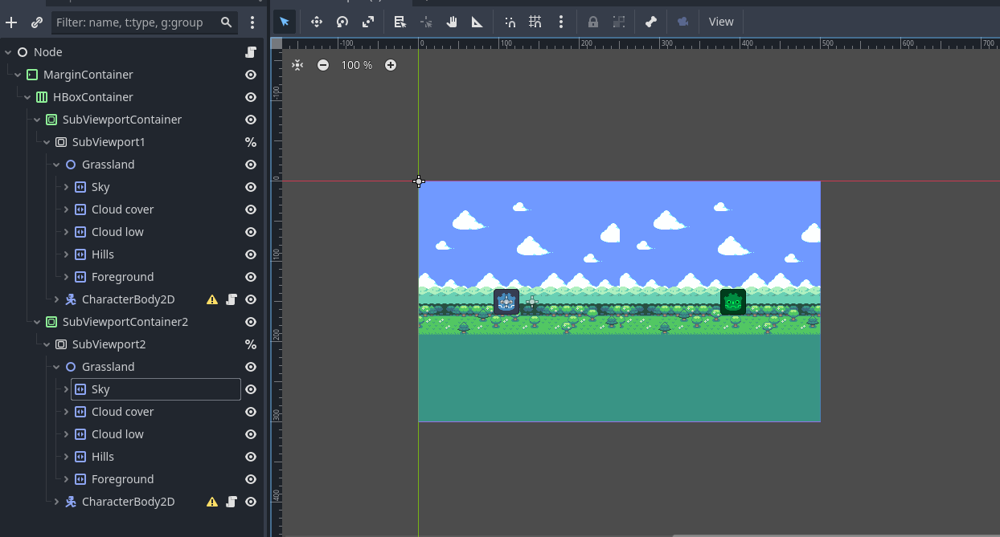

Of course, now both backgrounds show in both subviewports. What we want is for some nodes to be visible in one viewport but not another. While technically possible, this is not a feature officially supported by Godot at the moment. There is currently a proposal to make this much much simpler, so please look forward to it. https://github.com/godotengine/godot-proposals/issues/10014

As a workaround, we'll first select the first `SubViewport` and set its `canvas_cull_mask` to only layer 1, so it'll display all nodes with a `visibility_layer` layer 1 toggled. Then do the same for the second `SubViewport` but set its layer to 2 only.

For the nodes themselves, you'll need to set everything you want to display in both viewports to have a `visibility_layer` of both 1 and 2 set. Lastly, the `Parallax2D` node and all its descenants in the first `SubViewport` should have their `visibility_layer` set to only 1. Then do the same for the `Parallax2D` and all its descendents in the second `SubViewport` but with their `visibility_layer` only set to 2.

## How do I preview parallax in the editor?

Prior to `Parallax2D`, the recommendation was to place every layer in their own `ParallaxBackground`, enable the `follow_viewport_enabled` property, and scale the individual layer. This method has always been tricky to get right, but is still achievable by using a `CanvasLayer` instead of a `ParallaxBackground`.

Another recommendation is [KoBeWi's "Parallax2D Preview" addon](https://github.com/KoBeWi/Godot-Parallax2D-Preview). It provides a few different preview modes and is very handy!